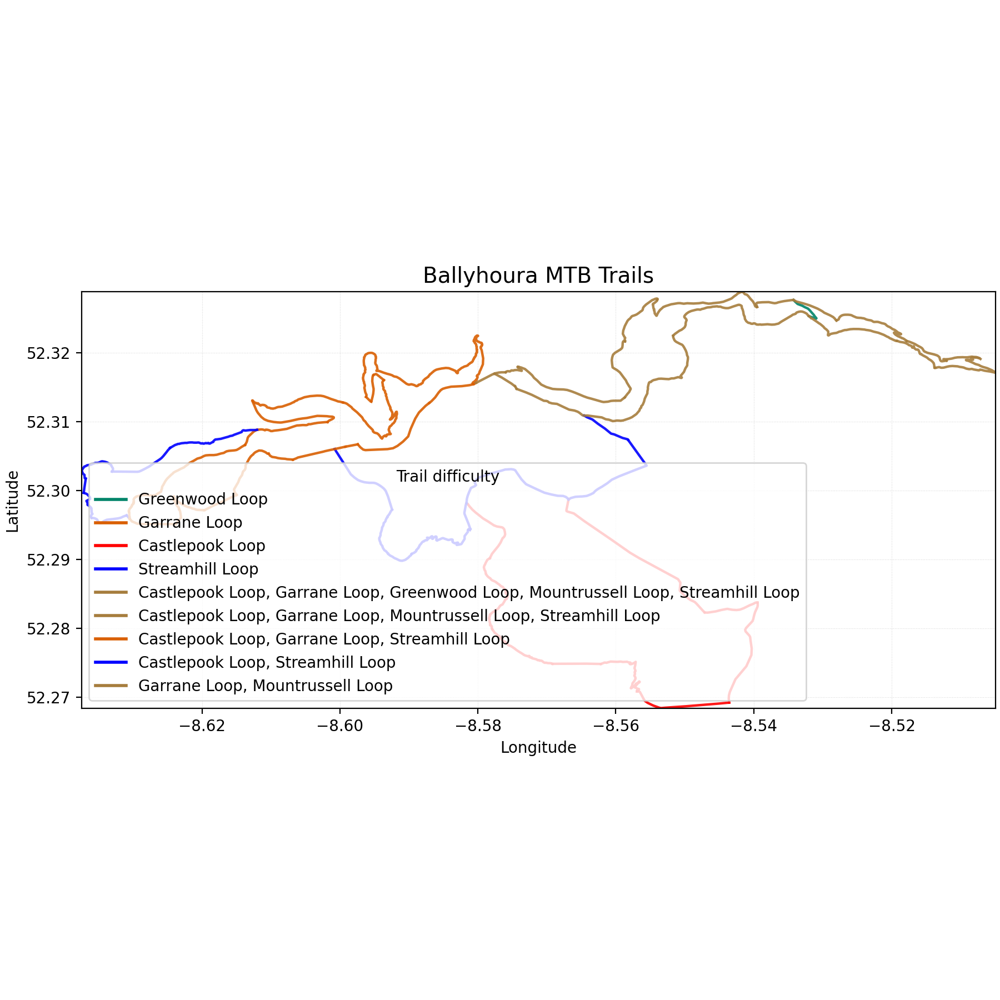
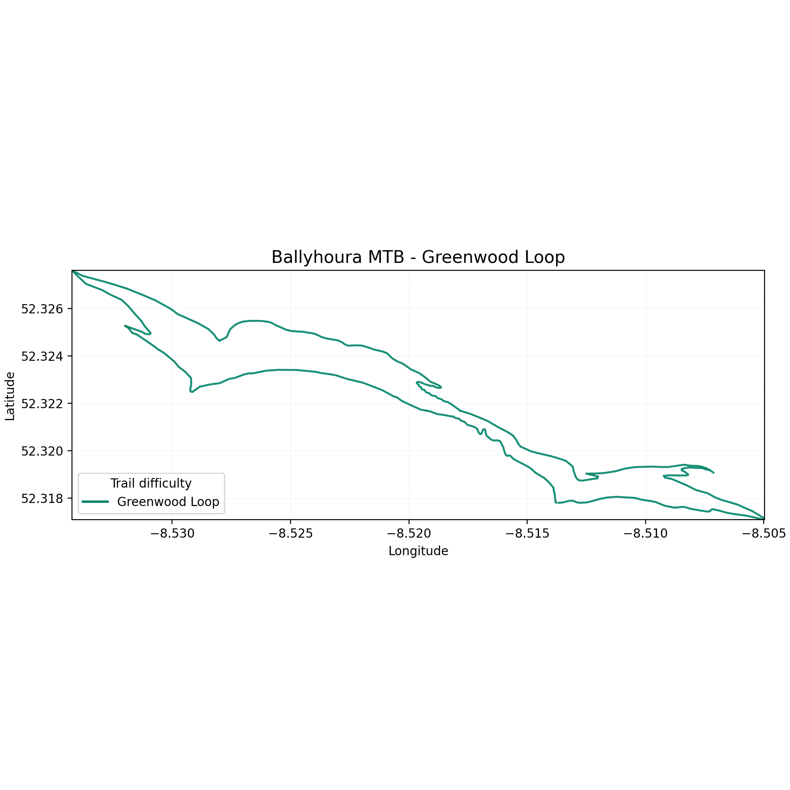
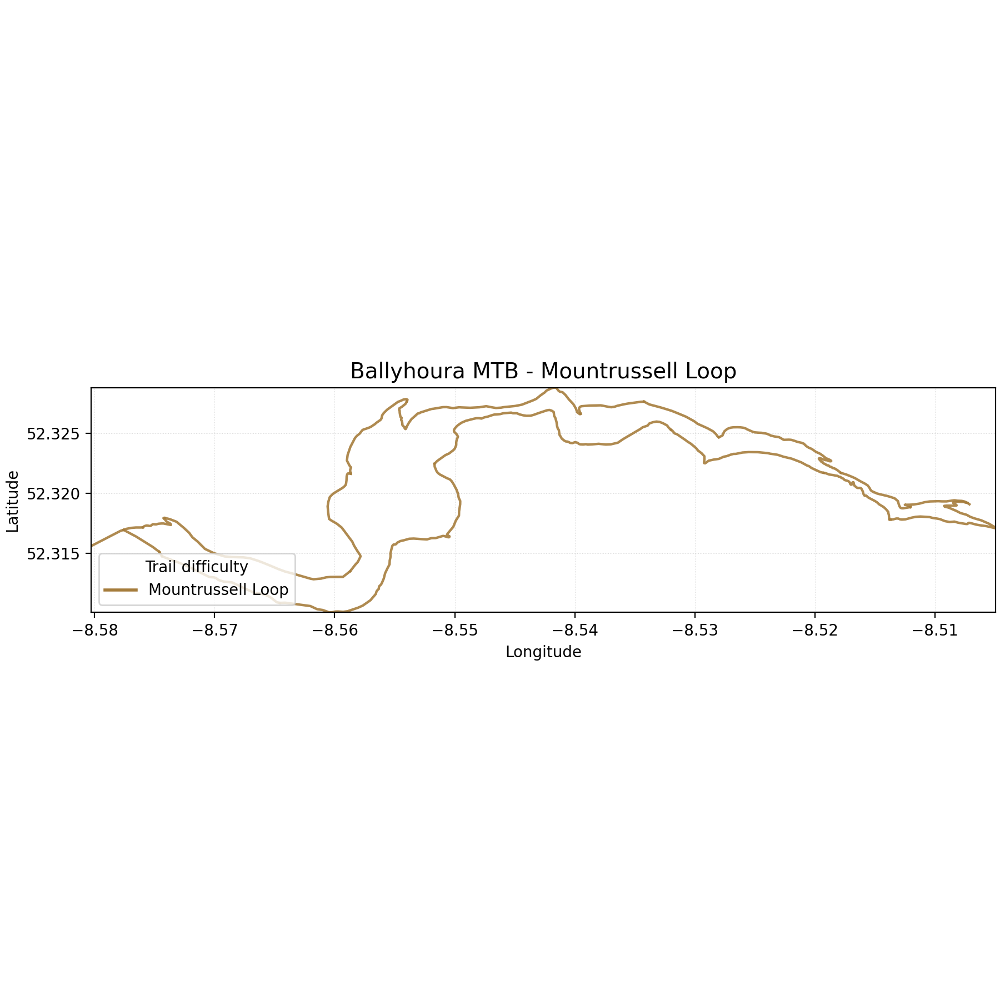
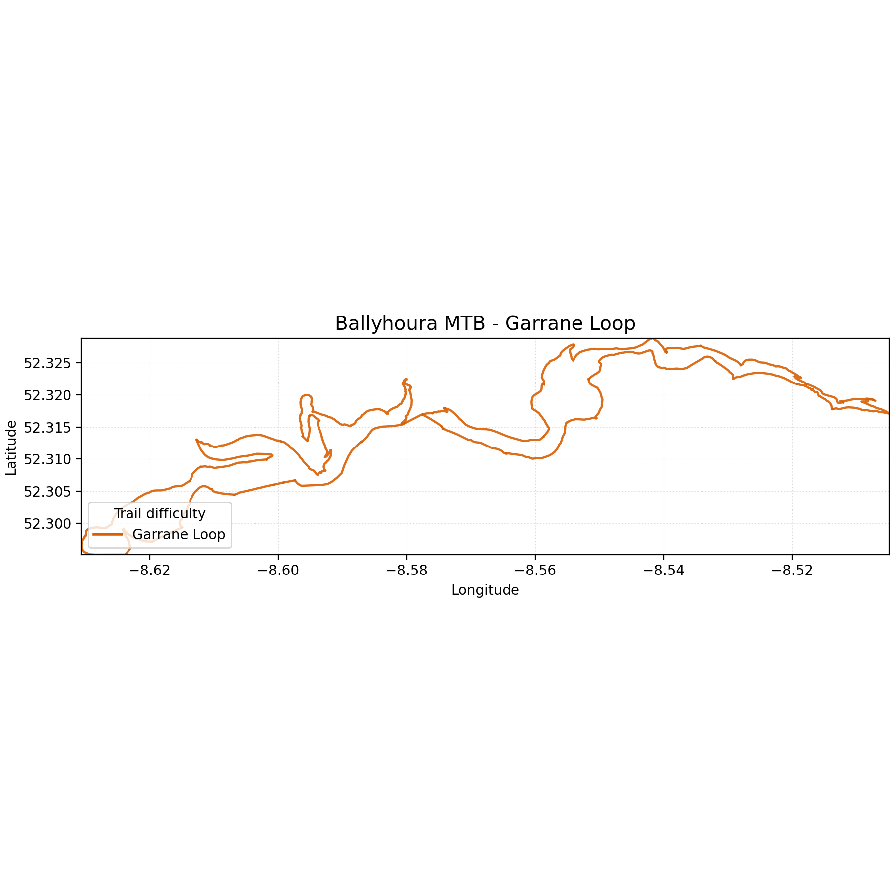
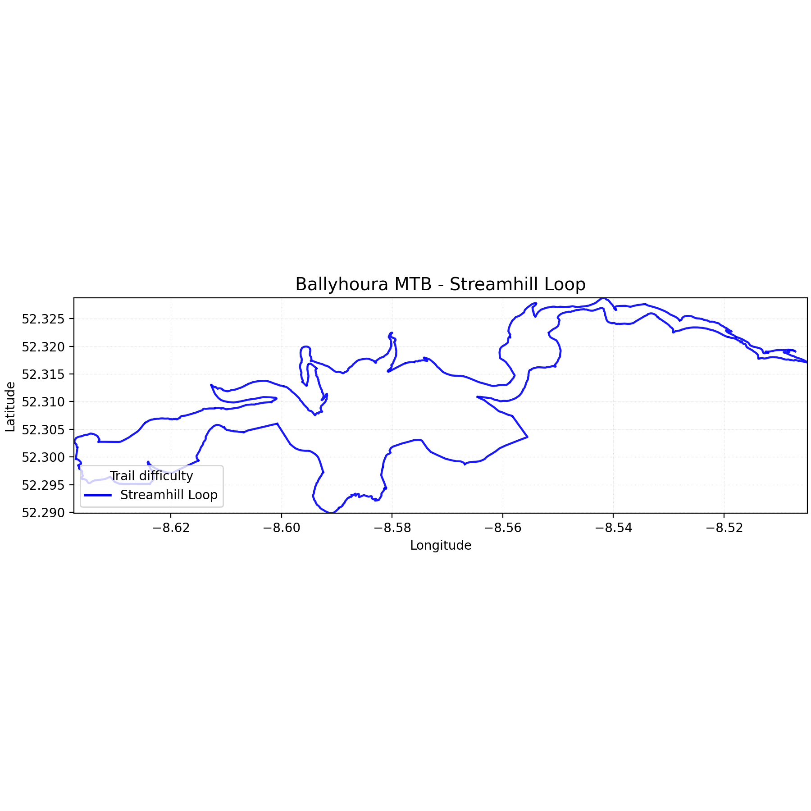
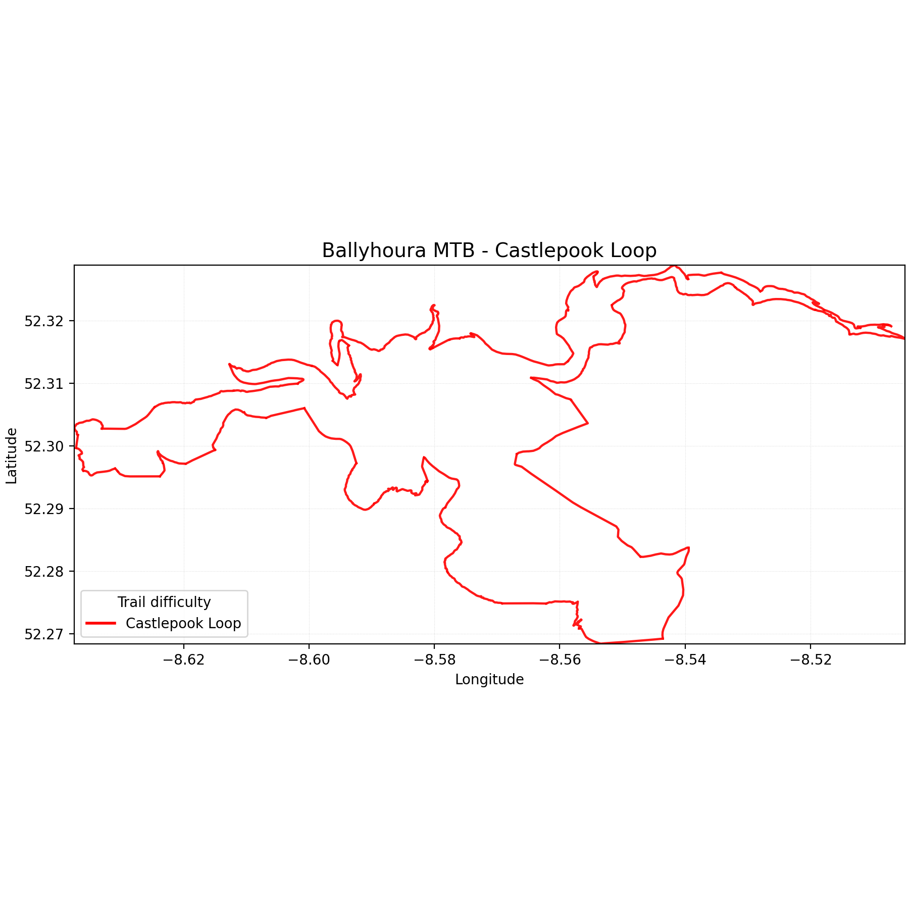

# Ballyhoura trails

In this repo, we extract MTB tracks data from cyclOSM (OpenStreetMap database) to generate various visualisations.

The main focus is around the official trails in Ballyhoura, next to Ardpatrick.

Area: https://www.cyclosm.org/#map=13/52.2979/-8.5451/cyclosm

## Scripts

- `fetch_ballyhoura_overpass.sh` – downloads the latest Ballyhoura MTB data via Overpass. Run `./fetch_ballyhoura_overpass.sh` (optional output filename as first argument).
- `render_ballyhoura_map.py` – renders the full trail network, or filtered loops via `--loop`. Requires `matplotlib`; e.g. `python render_ballyhoura_map.py --loop Garrane --loop Greenwood`.
- `render_loop_map.py` – convenience wrapper that outputs a PNG map for a single loop. Example: `python render_loop_map.py "Greenwood"`.
- `render_ballyhoura_folium.py` – builds an interactive Leaflet map (HTML) using Folium with per-loop toggles; add `--elevation-overlay` to enable contour + hillshade layers. Example: `python render_ballyhoura_folium.py --loop Garrane --elevation-overlay --output garrane.html`.
- `list_ballyhoura_trails.py` – prints the trail segments that make up each MTB loop with basic tagging. Run `python list_ballyhoura_trails.py`.
- `compute_loop_stats.py` – outputs the ordered list of segments for a loop with distance and (optional) ascent/descent. Provide an elevation CSV via `--elevations`. Example: `python compute_loop_stats.py --loop "Greenwood Loop" --elevations ballyhoura-elevation.csv`.
- `fetch_ballyhoura_elevation.py` – gathers elevation samples from the Open-Elevation API (requires `requests`). Example: `python fetch_ballyhoura_elevation.py --loops "Greenwood Loop" --output ballyhoura-elevation.csv`.
- `render_trail_profile.py` – plots an elevation profile for a single trail segment using a pre-fetched elevation CSV. Example: `python render_trail_profile.py --trail "Blue Grade - Green Machine" --elevations greenwood-elevation.csv`.
- `render_loop_profiles.py` – batch-generates elevation profiles for every segment in a loop. Example: `python render_loop_profiles.py --loop "Greenwood Loop" --elevations greenwood-elevation.csv --output-dir profiles/greenwood`.
- `generate_trails_markdown.py` – rebuilds `trails.md` with ride order, lengths, and key tags. Run `python generate_trails_markdown.py` after updating the Overpass export.
- `render_trail_profiles_html.py` – creates an interactive HTML viewer for any trail profile stored in the elevation CSVs. Example: `python render_trail_profiles_html.py --elevations greenwood-elevation.csv --elevations mountrussell-elevation.csv --output docs/index.html` (GitHub Pages reads from `docs/`).

### Loop stats workflow

Run the elevation fetcher (step 1) and stats script (step 2) for each loop:

```bash
# Greenwood
python fetch_ballyhoura_elevation.py --loops "Greenwood Loop" --output greenwood-elevation.csv --sleep 2 --max-retries 8 --batch-size 250
python compute_loop_stats.py --loop "Greenwood Loop" --elevations greenwood-elevation.csv

# Mountrussell
python fetch_ballyhoura_elevation.py --loops "Mountrussell Loop" --output mountrussell-elevation.csv --sleep 2 --max-retries 8 --batch-size 250
python compute_loop_stats.py --loop "Mountrussell Loop" --elevations mountrussell-elevation.csv

# Garrane
python fetch_ballyhoura_elevation.py --loops "Garrane Loop" --output garrane-elevation.csv --sleep 2 --max-retries 8 --batch-size 250
python compute_loop_stats.py --loop "Garrane Loop" --elevations garrane-elevation.csv

# Castlepook
python fetch_ballyhoura_elevation.py --loops "Castlepook Loop" --output castlepook-elevation.csv --sleep 2 --max-retries 8 --batch-size 250
python compute_loop_stats.py --loop "Castlepook Loop" --elevations castlepook-elevation.csv

# Streamhill
python fetch_ballyhoura_elevation.py --loops "Streamhill Loop" --output streamhill-elevation.csv --sleep 2 --max-retries 8 --batch-size 250
python compute_loop_stats.py --loop "Streamhill Loop" --elevations streamhill-elevation.csv
```

If the elevation API rate limits you, rerun the fetch command with a smaller `--batch-size`, a longer `--sleep` (e.g. `--sleep 2`), and/or higher `--max-retries`.

All scripts assume the Overpass export file is named `ballyhoura-overpass.json` unless an explicit path is provided.

## Visualisations



### Loop maps











## Further ideas

- Explore interactive maps with Folium (Leaflet) plus plugins such as scale bars, hillshade, and minimaps.
- Try GeoPandas with contextily/geoplot for static maps that include basemaps, scalebars, and richer styling than plain matplotlib.
